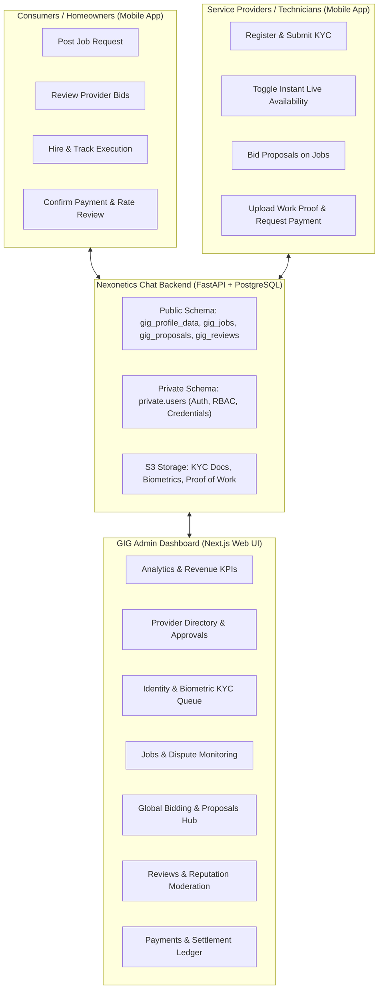
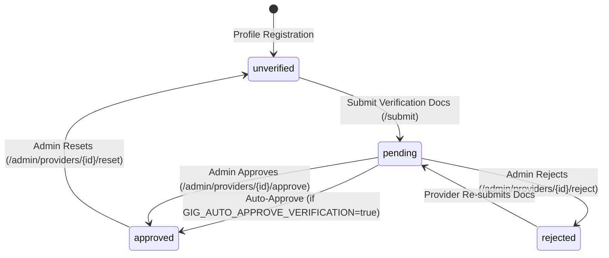
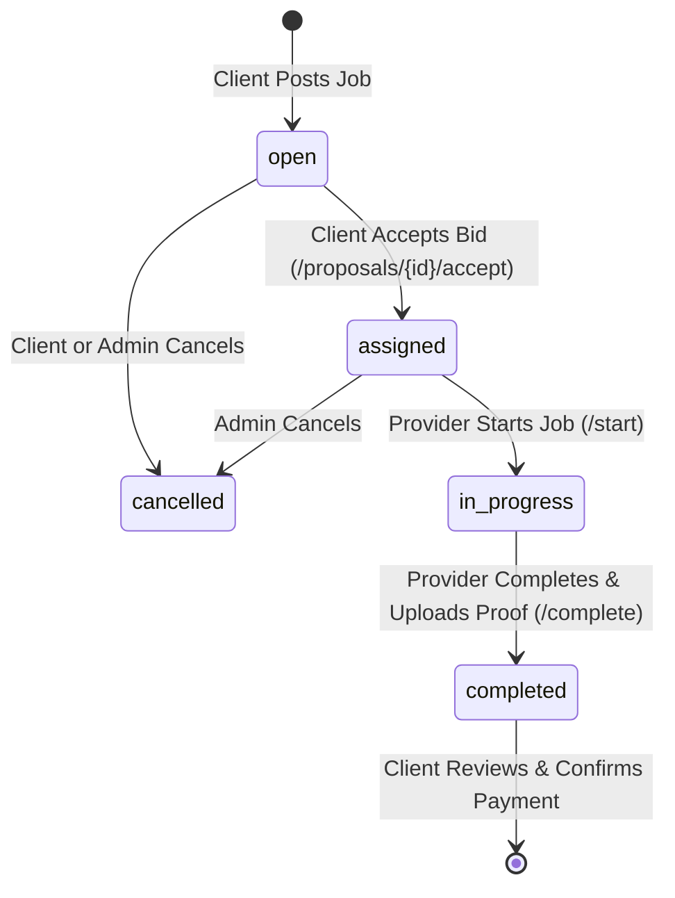

# GIG Collection: Dashboard Master Technical Requirements & Backend Integration Specification

**Document Version:** 1.0  
**Target Platform:** GIG Collection Marketplace Admin Dashboard (`gig_dashboard`) & Backend (`nexonetics_chat_backend`)  
**Reference Codebases:** `gig_dashboard` (Next.js), `nexonetics_chat_backend` (FastAPI), `chat_mobile` (Flutter)  
**Security Standard:** Bearer JWT Authentication + Role-Based Access Control (`UserRole.ADMIN` / `UserRole.SUPER_ADMIN`)  
**Base Namespace:** `/api/v1/jobs/GIG/...`

---

## 1. Executive Summary & Domain Architecture

### 1.1 The "GIG" Collection Concept
The **GIG** collection within the Nexonetics multi-tenant platform is a full-featured on-demand on-field service marketplace (electricians, plumbers, AC technicians, carpenters, cleaners, mechanics, etc.). It connects two distinct end-user personas while providing comprehensive administrative oversight:



### 1.2 Separation of Concerns
1. **Mobile Client (`chat_mobile`)**: Focuses on user-centric actions: job posting, bidding, in-progress execution, selfie verification submission, direct chat, and review submission.
2. **Backend (`nexonetics_chat_backend`)**: Multi-schema PostgreSQL database, S3 asset handling, real-time presence/availability, proposal bidding state transitions, and business logic.
3. **Web Dashboard (`gig_dashboard`)**: Central operational control plane for platform operators to review verification submissions, manage technician accounts, moderate user reviews, monitor financial transactions, and inspect platform analytics.

---

## 2. Current State vs. Dashboard Requirements Gap Matrix

| # | Dashboard Module | Dashboard UI Capability (`gig_dashboard`) | Current Backend Status (`nexonetics_chat_backend`) | Gap / Backend Refinement Required |
|:---:|:---|:---|:---|:---|
| **1** | **Overview & Analytics** | Real-time KPIs: Total Providers, Pending Verifications, Active Jobs, Completed Jobs, GMV Revenue, Average Platform Rating. | ❌ No dedicated stats endpoint. Frontend calculates values from mock data. | **Create `GET /api/v1/jobs/GIG/admin/stats`** providing aggregated counts and GMV totals in a single performant SQL call. |
| **2** | **Provider Management** | Search by name/email/phone, filter by status (`pending`, `approved`, `rejected`), view user credentials, trigger Approve / Reject / Reset. | ⚠️ `GET .../profile/providers` is hardcoded to `status = 'approved'`. Omits user email/phone. Only has `approve` and `reset`. | **Create `GET /api/v1/jobs/GIG/admin/providers`** joining `private.users`. Add **`POST /admin/providers/{id}/reject`**. |
| **3** | **Verification Queue** | Card grid of pending KYC: ID front/back photo, selfie photo, ID type, ID number, GPS coordinate accuracy. Quick Approve / Reject. | ⚠️ Backend has `approve` & `reset` on `/profile/verify/`, but no endpoint dedicated to listing pending verification queue. | **Create `GET /api/v1/jobs/GIG/admin/verifications/pending`** with un-redacted document URLs and geo-validation. |
| **4** | **Jobs Management** | Master feed across all statuses (`open`, `assigned`, `in_progress`, `completed`, `cancelled`). View client, provider, proof photos, timeline. Close/cancel jobs. | ⚠️ `GET .../jobs/list` defaults to `open` jobs only; omits assigned technician details, proof images, proposals count. `close_job` checks `job.client_id == current_user.id`. | **Create `GET /api/v1/jobs/GIG/admin/jobs`** with rich joins (client + technician + proposals + proofs). Add **`POST /admin/jobs/{id}/cancel`** with admin override. |
| **5** | **Proposals & Bidding Hub** | System-wide table of all bids across all jobs: job title, technician name, price (₹), duration, message, status. | ❌ `GET .../jobs/{id}/proposals` requires a specific `job_id` and is strictly restricted to the job's creator. | **Create `GET /api/v1/jobs/GIG/admin/proposals`** with cross-job pagination, status filter, and provider joins. |
| **6** | **Reviews & Moderation** | Master feed of client reviews, star ratings, and praise tags. Moderation action to delete/hide abusive reviews. | ⚠️ Only has `GET .../providers/{id}/reviews` for a single provider. No global listing. No delete/moderation endpoint. | **Create `GET /api/v1/jobs/GIG/admin/reviews`** across all jobs and **`DELETE /api/v1/jobs/GIG/admin/reviews/{id}`** with automatic rating recalculation. |
| **7** | **Payments Ledger** | Financial audit table: payment ID, job title, client, technician, amount, payment method (cash/UPI/card), status, receipt. | ❌ **Completely missing from backend.** Table `gig_payments` is not in database migrations, and no payment endpoints exist. | **Execute DDL migration for `public.gig_payments`**. Implement client/provider payment endpoints and **`GET /api/v1/jobs/GIG/admin/payments`**. |
| **8** | **Audit Trail / Timeline** | Step-by-step progress history (`POSTED` -> `ASSIGNED` -> `IN_PROGRESS` -> `COMPLETED` -> `REVIEWED`). | ❌ **Missing from backend.** Table `gig_job_logs` is not migrated. Timeline endpoint returns empty or fails. | **Execute DDL migration for `public.gig_job_logs`**. Implement automatic audit logger on job state transitions and **`GET .../jobs/{id}/timeline`**. |

---

## 3. Database Architecture & DDL Migrations

The database uses PostgreSQL with a multi-schema architecture: `private` holds core system users, while `public` holds GIG marketplace domain tables.

### 3.1 Migration Script: `migrate_gig_dashboard_extensions.sql`

```sql
-- ============================================================================
-- NEXONETICS GIG MARKETPLACE: DATABASE EXTENSIONS MIGRATION
-- Run on PostgreSQL database: collections_db
-- ============================================================================

-- 1. Extend gig_profile_data with verification audit & rejection tracking
ALTER TABLE public.gig_profile_data
ADD COLUMN IF NOT EXISTS rejection_reason TEXT NULL,
ADD COLUMN IF NOT EXISTS verified_at TIMESTAMP WITH TIME ZONE NULL,
ADD COLUMN IF NOT EXISTS verified_by_user_id INT NULL REFERENCES private.users(id) ON DELETE SET NULL;

CREATE INDEX IF NOT EXISTS idx_gig_profile_admin_status 
ON public.gig_profile_data(status, created_at DESC);

-- 2. Extend gig_jobs with payment & cancellation tracking
ALTER TABLE public.gig_jobs
ADD COLUMN IF NOT EXISTS payment_status VARCHAR(30) NOT NULL DEFAULT 'unpaid',
ADD COLUMN IF NOT EXISTS cancellation_reason TEXT NULL,
ADD COLUMN IF NOT EXISTS cancelled_by_user_id INT NULL REFERENCES private.users(id) ON DELETE SET NULL;

CREATE INDEX IF NOT EXISTS idx_gig_jobs_status_created 
ON public.gig_jobs(status, created_at DESC);

-- 3. Create gig_payments table (Financial Ledger)
CREATE TABLE IF NOT EXISTS public.gig_payments (
    id SERIAL PRIMARY KEY,
    job_id INT NOT NULL REFERENCES public.gig_jobs(id) ON DELETE CASCADE,
    client_user_id INT NOT NULL REFERENCES private.users(id) ON DELETE CASCADE,
    provider_user_id INT NOT NULL REFERENCES private.users(id) ON DELETE CASCADE,
    amount NUMERIC(10, 2) NOT NULL,
    payment_method VARCHAR(30) NOT NULL DEFAULT 'cash', -- 'cash', 'upi_qr', 'bank_transfer', 'card'
    payment_status VARCHAR(30) NOT NULL DEFAULT 'unpaid', -- 'unpaid', 'pending_confirmation', 'paid', 'refunded'
    receipt_url TEXT NULL,
    notes TEXT NULL,
    created_at TIMESTAMP WITH TIME ZONE DEFAULT CURRENT_TIMESTAMP,
    confirmed_at TIMESTAMP WITH TIME ZONE NULL
);

CREATE INDEX IF NOT EXISTS idx_gig_payments_job_id ON public.gig_payments(job_id);
CREATE INDEX IF NOT EXISTS idx_gig_payments_status ON public.gig_payments(payment_status, created_at DESC);
CREATE INDEX IF NOT EXISTS idx_gig_payments_provider ON public.gig_payments(provider_user_id);
CREATE INDEX IF NOT EXISTS idx_gig_payments_client ON public.gig_payments(client_user_id);

-- 4. Create gig_job_logs table (Audit Trail History)
CREATE TABLE IF NOT EXISTS public.gig_job_logs (
    id SERIAL PRIMARY KEY,
    job_id INT NOT NULL REFERENCES public.gig_jobs(id) ON DELETE CASCADE,
    actor_user_id INT NOT NULL REFERENCES private.users(id) ON DELETE CASCADE,
    step VARCHAR(50) NOT NULL, -- 'POSTED', 'ASSIGNED', 'IN_PROGRESS', 'COMPLETED', 'PAYMENT_REQUESTED', 'PAID', 'REVIEWED', 'CANCELLED'
    title VARCHAR(255) NOT NULL,
    details TEXT NULL,
    created_at TIMESTAMP WITH TIME ZONE DEFAULT CURRENT_TIMESTAMP
);

CREATE INDEX IF NOT EXISTS idx_gig_job_logs_timeline ON public.gig_job_logs(job_id, created_at ASC);
```

---

## 4. Master Technical API Specification (Admin Endpoints)

### Common Request Headers
All endpoints below require standard administrative authentication:
```http
Authorization: Bearer <ADMIN_JWT_TOKEN>
Content-Type: application/json
```
Authentication dependency: `current_user: User = Depends(require_role(UserRole.ADMIN))`

---

### Module 1: Overview & Analytics KPIs

#### 1.1 Fetch Dashboard Master Statistics
* **Method:** `GET`
* **Path:** `/api/v1/jobs/GIG/admin/stats`
* **Description:** Returns aggregated platform metrics required by the dashboard `OverviewStats.tsx` component.
* **Response `200 OK`:**
```json
{
  "success": true,
  "data": {
    "total_providers": 48,
    "pending_approvals": 6,
    "approved_providers": 39,
    "rejected_providers": 3,
    "active_jobs": 14,
    "completed_jobs": 52,
    "total_revenue": 148500.00,
    "average_rating": 4.86,
    "growth_metrics": {
      "providers_this_month": 12,
      "jobs_this_month": 28,
      "revenue_this_month": 42000.00
    }
  }
}
```

---

### Module 2: Provider Directory Management

#### 2.1 Search & List All Providers (Admin View)
* **Method:** `GET`
* **Path:** `/api/v1/jobs/GIG/admin/providers`
* **Query Parameters:**
  - `search` *(optional, string)*: Filter by full name, username, email, or mobile phone.
  - `status` *(optional, string)*: Filter by `pending`, `approved`, `rejected`, `unverified`, or `all` (default: `all`).
  - `specialization` *(optional, string)*: Filter by trade (e.g. `Electrician`, `Plumber`).
  - `city` *(optional, string)*: City filter.
  - `page` *(optional, int, default: 1)*: Page number.
  - `size` *(optional, int, default: 20)*: Page size (max: 100).
* **Response `200 OK`:**
```json
{
  "success": true,
  "data": {
    "providers": [
      {
        "id": 1,
        "user_id": 14,
        "name": "Martin George",
        "username": "martin_tech",
        "email": "martin.g@example.com",
        "mobile": "+91 98470 12345",
        "first_name": "Martin",
        "last_name": "George",
        "specialization": "Electrician",
        "bio": "Licensed master electrician with 10+ years experience.",
        "avatar_url": "https://mediamessage.s3.ap-south-1.amazonaws.com/profiles/martin.jpg",
        "city": "Kochi",
        "area": "Kaloor",
        "latitude": 9.9981,
        "longitude": 76.2999,
        "working_radius": 50.0,
        "rating": 4.9,
        "review_count": 28,
        "status": "approved",
        "registered_on": "2026-08-14T09:30:00Z",
        "is_available_now": true,
        "availability_status": "available",
        "availability_note": "Available for emergency electrical callouts",
        "id_type": "Aadhaar",
        "id_number": "XXXX-XXXX-4589",
        "id_front_url": "https://mediamessage.s3.ap-south-1.amazonaws.com/gig/verify/id_front_1.jpg",
        "id_back_url": "https://mediamessage.s3.ap-south-1.amazonaws.com/gig/verify/id_back_1.jpg",
        "selfie_url": "https://mediamessage.s3.ap-south-1.amazonaws.com/gig/verify/selfie_1.jpg",
        "is_identity_verified": true,
        "is_selfie_verified": true,
        "is_location_verified": true,
        "verified_at": "2026-08-15T11:00:00Z",
        "rejection_reason": null
      }
    ],
    "pagination": {
      "page": 1,
      "size": 20,
      "total_items": 48,
      "total_pages": 3
    }
  }
}
```

#### 2.2 Reject Provider Verification
* **Method:** `POST`
* **Path:** `/api/v1/jobs/GIG/admin/providers/{provider_id}/reject`
* **Request Body:**
```json
{
  "reason": "Selfie image does not match the photo on the Aadhaar card. Please upload a clear photo in good lighting."
}
```
* **Response `200 OK`:**
```json
{
  "success": true,
  "message": "Provider verification rejected.",
  "data": {
    "id": 1,
    "status": "rejected",
    "rejection_reason": "Selfie image does not match the photo on the Aadhaar card."
  }
}
```

#### 2.3 Approve Provider Verification
* **Method:** `POST`
* **Path:** `/api/v1/jobs/GIG/admin/providers/{provider_id}/approve`
* **Description:** Manually overrides provider status to `approved`, sets `is_identity_verified=true`, `is_selfie_verified=true`, `is_location_verified=true`, and sets `verified_at = CURRENT_TIMESTAMP`.

#### 2.4 Reset Provider Verification
* **Method:** `POST`
* **Path:** `/api/v1/jobs/GIG/admin/providers/{provider_id}/reset`
* **Description:** Reverts provider status to `unverified` and clears document references for re-submission.

---

### Module 3: Verification Queue & KYC Audit

#### 3.1 List Pending Identity Verifications
* **Method:** `GET`
* **Path:** `/api/v1/jobs/GIG/admin/verifications/pending`
* **Description:** Fetches all providers with `status = 'pending'`, sorted by submission time (`updated_at ASC`) for FIFO queue processing in `VerificationQueue.tsx`.
* **Response `200 OK`:**
```json
{
  "success": true,
  "data": {
    "total_pending": 3,
    "queue": [
      {
        "id": 4,
        "user_id": 22,
        "name": "Arun Kumar",
        "specialization": "AC Service",
        "mobile": "+91 97450 44556",
        "city": "Kochi",
        "area": "Edapally",
        "latitude": 10.0261,
        "longitude": 76.3125,
        "id_type": "Driving License",
        "id_number": "DL-KL07-201800293",
        "id_front_url": "https://mediamessage.s3.ap-south-1.amazonaws.com/gig/verify/dl_front.jpg",
        "id_back_url": "https://mediamessage.s3.ap-south-1.amazonaws.com/gig/verify/dl_back.jpg",
        "selfie_url": "https://mediamessage.s3.ap-south-1.amazonaws.com/gig/verify/selfie.jpg",
        "submitted_at": "2026-09-30T04:12:00Z"
      }
    ]
  }
}
```

---

### Module 4: Jobs Management & Dispute Monitoring

#### 4.1 Master Jobs Feed (Admin View)
* **Method:** `GET`
* **Path:** `/api/v1/jobs/GIG/admin/jobs`
* **Query Parameters:**
  - `search` *(optional)*: Search title, description, client name, or city.
  - `status` *(optional)*: Filter by `open`, `assigned`, `in_progress`, `completed`, `cancelled`, or `all` (default: `all`).
  - `category` *(optional)*: Category filter.
  - `page` *(optional, int)*: Page index.
  - `size` *(optional, int)*: Page size.
* **Response `200 OK`:**
```json
{
  "success": true,
  "data": {
    "jobs": [
      {
        "id": 101,
        "client_id": 5,
        "client_name": "Deepak Menon",
        "client_phone": "+91 98460 77889",
        "client_avatar_url": "https://mediamessage.s3.ap-south-1.amazonaws.com/profiles/deepak.jpg",
        "title": "Complete 3BHK DB Board Wiring & MCB Replacement",
        "description": "Short circuit in main board. Need certified technician to replace 63A MCB and re-route cabling.",
        "category": "Electrician",
        "budget": 3500.00,
        "city": "Kochi",
        "area": "Panampilly Nagar",
        "status": "in_progress",
        "payment_status": "unpaid",
        "assigned_provider_id": 1,
        "assigned_provider_name": "Martin George",
        "assigned_provider_phone": "+91 98470 12345",
        "assigned_provider_avatar": "https://mediamessage.s3.ap-south-1.amazonaws.com/profiles/martin.jpg",
        "assigned_proposal_id": 204,
        "proposals_count": 4,
        "started_at": "2026-09-29T10:30:00Z",
        "completed_at": null,
        "created_at": "2026-09-28T08:15:00Z",
        "proof_images": []
      }
    ],
    "pagination": {
      "page": 1,
      "size": 20,
      "total_items": 66,
      "total_pages": 4
    }
  }
}
```

#### 4.2 Admin Cancel / Force-Close Job
* **Method:** `POST`
* **Path:** `/api/v1/jobs/GIG/admin/jobs/{job_id}/cancel`
* **Request Body:**
```json
{
  "reason": "Violation of marketplace safety policies or duplicate posting."
}
```
* **Response `200 OK`:**
```json
{
  "success": true,
  "message": "Job cancelled by administrator.",
  "data": {
    "job_id": 101,
    "status": "cancelled",
    "cancellation_reason": "Violation of marketplace safety policies."
  }
}
```

#### 4.3 Job Audit Trail / Timeline
* **Method:** `GET`
* **Path:** `/api/v1/jobs/GIG/jobs/{job_id}/timeline`
* **Response `200 OK`:**
```json
{
  "success": true,
  "data": {
    "job_id": 101,
    "timeline": [
      {
        "step": "POSTED",
        "title": "Service Request Posted",
        "timestamp": "2026-09-28T08:15:00Z",
        "actor": "Deepak Menon (Client)",
        "details": "Job opened with budget ₹3,500."
      },
      {
        "step": "ASSIGNED",
        "title": "Provider Hired",
        "timestamp": "2026-09-28T14:20:00Z",
        "actor": "Deepak Menon (Client)",
        "details": "Accepted bid of ₹3,200 from Martin George."
      },
      {
        "step": "IN_PROGRESS",
        "title": "Job Commenced",
        "timestamp": "2026-09-29T10:30:00Z",
        "actor": "Martin George (Provider)",
        "details": "Technician arrived on-site."
      }
    ]
  }
}
```

---

### Module 5: Proposals & Bidding Hub

#### 5.1 Global Proposals Feed (Admin View)
* **Method:** `GET`
* **Path:** `/api/v1/jobs/GIG/admin/proposals`
* **Query Parameters:**
  - `status` *(optional)*: Filter by `pending`, `accepted`, `rejected`, `withdrawn`, or `all`.
  - `job_id` *(optional)*: Filter by specific job.
  - `provider_id` *(optional)*: Filter by provider.
  - `page` *(optional, int)*: Page index.
  - `size` *(optional, int)*: Page size.
* **Response `200 OK`:**
```json
{
  "success": true,
  "data": {
    "proposals": [
      {
        "id": 204,
        "job_id": 101,
        "job_title": "Complete 3BHK DB Board Wiring & MCB Replacement",
        "provider_id": 1,
        "provider_user_id": 14,
        "provider_name": "Martin George",
        "provider_avatar_url": "https://mediamessage.s3.ap-south-1.amazonaws.com/profiles/martin.jpg",
        "provider_specialization": "Electrician",
        "provider_rating": 4.9,
        "provider_review_count": 28,
        "proposed_price": 3200.00,
        "estimated_duration": "4 Hours",
        "message": "I have Schneider 63A isolators and copper busbars ready in stock. Can complete today.",
        "status": "accepted",
        "created_at": "2026-09-28T10:05:00Z"
      }
    ],
    "pagination": {
      "page": 1,
      "size": 20,
      "total_items": 112,
      "total_pages": 6
    }
  }
}
```

---

### Module 6: Reviews & Reputation Moderation

#### 6.1 Master Reviews Feed (Admin View)
* **Method:** `GET`
* **Path:** `/api/v1/jobs/GIG/admin/reviews`
* **Query Parameters:**
  - `min_rating` *(optional, int, 1-5)*: Filter low ratings.
  - `provider_id` *(optional, int)*: Provider filter.
  - `page` *(optional, int)*: Page index.
  - `size` *(optional, int)*: Page size.
* **Response `200 OK`:**
```json
{
  "success": true,
  "data": {
    "reviews": [
      {
        "id": 31,
        "job_id": 88,
        "job_title": "Fixing leaking kitchen sink pipe",
        "client_user_id": 9,
        "client_name": "Sarah Paul",
        "client_avatar_url": "https://mediamessage.s3.ap-south-1.amazonaws.com/profiles/sarah.jpg",
        "provider_id": 3,
        "provider_name": "Thomas K.",
        "rating": 5,
        "comment": "Very polite and arrived within 20 minutes of accepting the bid! Clean work.",
        "tags": ["Punctual", "FairPrice", "CleanWork"],
        "created_at": "2026-09-27T16:45:00Z"
      }
    ],
    "pagination": {
      "page": 1,
      "size": 20,
      "total_items": 45,
      "total_pages": 3
    }
  }
}
```

#### 6.2 Delete / Moderate Review (Admin)
* **Method:** `DELETE`
* **Path:** `/api/v1/jobs/GIG/admin/reviews/{review_id}`
* **Description:** Deletes a fake, spam, or abusive review and **automatically triggers recalculation** of the affected provider's average rating and review count.
* **Response `200 OK`:**
```json
{
  "success": true,
  "message": "Review removed successfully and provider rating recalculated.",
  "data": {
    "review_id": 31,
    "provider_id": 3,
    "updated_rating": 4.88,
    "updated_review_count": 27
  }
}
```

---

### Module 7: Payments & Financial Ledger

#### 7.1 Master Payments Ledger (Admin View)
* **Method:** `GET`
* **Path:** `/api/v1/jobs/GIG/admin/payments`
* **Query Parameters:**
  - `status` *(optional)*: `paid`, `pending_confirmation`, `unpaid`, `refunded`, or `all`.
  - `payment_method` *(optional)*: `cash`, `upi_qr`, `bank_transfer`, `card`.
  - `page` *(optional, int)*: Page index.
  - `size` *(optional, int)*: Page size.
* **Response `200 OK`:**
```json
{
  "success": true,
  "data": {
    "total_revenue": 148500.00,
    "payments": [
      {
        "id": 501,
        "job_id": 88,
        "job_title": "Fixing leaking kitchen sink pipe",
        "client_user_id": 9,
        "client_name": "Sarah Paul",
        "provider_user_id": 16,
        "provider_name": "Thomas K.",
        "amount": 1200.00,
        "payment_method": "upi_qr",
        "payment_status": "paid",
        "receipt_url": "https://mediamessage.s3.ap-south-1.amazonaws.com/gig/receipts/rec_501.pdf",
        "notes": "Direct UPI payment to technician QR code",
        "created_at": "2026-09-27T16:30:00Z",
        "confirmed_at": "2026-09-27T16:32:00Z"
      }
    ],
    "pagination": {
      "page": 1,
      "size": 20,
      "total_items": 52,
      "total_pages": 3
    }
  }
}
```

#### 7.2 Request Payment (Provider / Client Flow)
* **Method:** `POST`
* **Path:** `/api/v1/jobs/GIG/jobs/{job_id}/payment/request`
* **Authorization:** Assigned Provider
* **Request Body:**
```json
{
  "amount": 3200.00,
  "payment_method": "upi_qr",
  "notes": "Materials ₹2,000 + Labor ₹1,200"
}
```
* **Response `201 Created`:** Sets job `payment_status = 'pending_confirmation'` and inserts record into `public.gig_payments`.

#### 7.3 Confirm Payment (Client Flow)
* **Method:** `POST`
* **Path:** `/api/v1/jobs/GIG/jobs/{job_id}/payment/confirm`
* **Authorization:** Job Owner Client
* **Request Body:**
```json
{
  "payment_id": 501,
  "payment_method": "upi_qr",
  "receipt_url": "https://mediamessage.s3.ap-south-1.amazonaws.com/gig/receipts/rec_501.pdf"
}
```
* **Response `200 OK`:** Updates `payment_status = 'paid'`, records `confirmed_at = CURRENT_TIMESTAMP`, and adds audit step `PAID` to `gig_job_logs`.

---

## 5. Business Logic & State Machines

### 5.1 Provider Verification State Machine


### 5.2 Job Execution & Payment State Machine


### 5.3 Rating Recalculation Engine
Whenever a review is inserted via `POST /jobs/{id}/review` or removed via `DELETE /admin/reviews/{id}`, the backend must execute:
```sql
WITH stats AS (
    SELECT 
        COUNT(*)::INT AS total_count,
        COALESCE(ROUND(AVG(rating)::NUMERIC, 2), 0.00) AS avg_rating
    FROM public.gig_reviews
    WHERE provider_id = :provider_id
)
UPDATE public.gig_profile_data
SET 
    review_count = stats.total_count,
    rating = stats.avg_rating,
    updated_at = NOW()
FROM stats
WHERE id = :provider_id;
```

---

## 6. Frontend Integration Architecture (`gig_dashboard`)

### 6.1 Environment Configuration
Create `/home/nexonetics/nexonetics/gig_dashboard/.env.local`:
```env
NEXT_PUBLIC_API_BASE_URL=https://api3.made2tech.com/api/v1
# Local fallback:
# NEXT_PUBLIC_API_BASE_URL=http://localhost:8000/api/v1
NEXT_PUBLIC_COLLECTION_NAME=GIG
```

### 6.2 Typed API Service Layer: `src/services/gigApi.ts`
Implement standard Axios/Fetch wrapper providing:
- `fetchStats()`: Calls `/api/v1/jobs/GIG/admin/stats`
- `fetchProviders(params)`: Calls `/api/v1/jobs/GIG/admin/providers`
- `approveProvider(id)`: Calls `POST /api/v1/jobs/GIG/admin/providers/{id}/approve`
- `rejectProvider(id, reason)`: Calls `POST /api/v1/jobs/GIG/admin/providers/{id}/reject`
- `resetVerification(id)`: Calls `POST /api/v1/jobs/GIG/admin/providers/{id}/reset`
- `fetchJobs(params)`: Calls `/api/v1/jobs/GIG/admin/jobs`
- `cancelJob(id, reason)`: Calls `POST /api/v1/jobs/GIG/admin/jobs/{id}/cancel`
- `fetchProposals(params)`: Calls `/api/v1/jobs/GIG/admin/proposals`
- `fetchReviews(params)`: Calls `/api/v1/jobs/GIG/admin/reviews`
- `deleteReview(id)`: Calls `DELETE /api/v1/jobs/GIG/admin/reviews/{id}`
- `fetchPayments(params)`: Calls `/api/v1/jobs/GIG/admin/payments`

### 6.3 Dashboard State Migration Plan
1. In `src/app/page.tsx`, replace `useState(INITIAL_PROVIDERS)` with `useEffect` data fetching or React Query / SWR hooks.
2. Add global loading skeletons and toast notifications for network errors.
3. Include an authentication token interceptor to automatically attach `Bearer <JWT_TOKEN>` from `localStorage` or session cookie.

---

## 7. Security, Best Practices & Backend Verification Checklist

1. **Role Verification**: Protect all `/admin/*` routes using `Depends(require_role(UserRole.ADMIN))` in `app/api/deps.py`. Prevent regular clients and providers from accessing admin endpoints.
2. **SQL Injection Defense**: Use parameterized SQL queries with SQLAlchemy `text(...)` binding (`:param`), never string formatting or f-strings for user inputs.
3. **Pagination & Denial-of-Service Defense**: Enforce strict pagination bounds (`ge=1, le=100`) on all listing endpoints.
4. **CORS Headers**: Ensure `CORSMiddleware` in `app/main.py` explicitly allows the dashboard deployment origin (e.g. `http://localhost:3000`, `https://dashboard.made2tech.com`).
5. **Multi-Tenant Protection**: Explicitly scope all queries to the `GIG` collection domain. Do not allow leakage between `TECHFORM`, `SHALABAM`, and `GIG` data stores.
